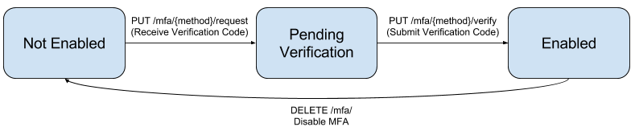

.. _configuration-guide:

=============================================================================
                                Usage
=============================================================================

Introduction
============

This library provides support for enabling Multifactor Authentication and then
authenticating through MFA.

Currently, the library only supports multifactor authentication over SMS, but
it can be easily extended to support new challenge types. The high level
API is as followed.

View detailed URL documentation here_.

.. _here: ../reference/deux.html

Getting MFA Status
==================

Users can submit a request to ``GET mfa/`` to get information about whether MFA
is enabled and which phone number it is enabled through.

Authentication
==============

Deux supports authentication through both ``authtoken`` and ``oauth2``. For both of these protocols, users must submit their username, password, and an MFA code or backup code. If the request is submitted without the token, they will be prompted for a token.

#. For ``authtoken``, place the request to ``PUT /mfa/authtoken/login``.

#. For ``oauth2``, place the request to ``PUT /mfa/oauth2/token`` with a
   ``password`` grant type.

If MFA is not enabled, these endpoints will behave like the base authentication protocols.

Enabling MFA
============

The enabling process involves submitting a request to an MFA method and receiving back a code. The user must then submit the code to verify the request. If the code is correct, the MFA will then be enabled.

MFA can be enabled through the following methods:

SMS
---

To enable MFA through SMS, the user must first submit a request to
``PUT mfa/sms/request/`` with a phone number, which will send an SMS to the
phone number with the MFA code.

The user should then submit a ``PUT mfa/sms/verify/`` request with the MFA code
to enable MFA.

Disabling MFA
=============

Users can submit a ``DELETE mfa/`` request to disable MFA.

Backup Code
===========

Users only have one backup code which can be used to authenticate. If you use
a backup code to authenticate, MFA will be disabled. To get the backup code,
the user can submit a request to ``GET mfa/recovery``.

The backup code will be reset every request.

